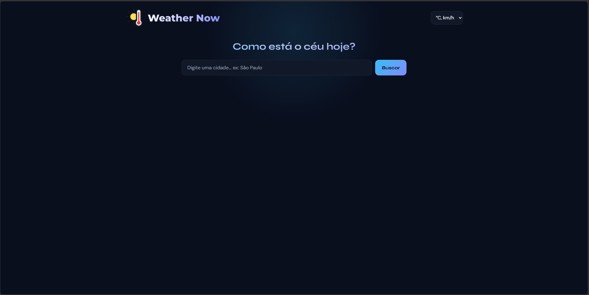
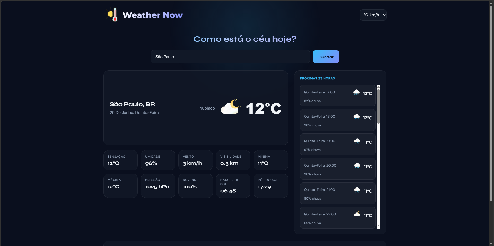
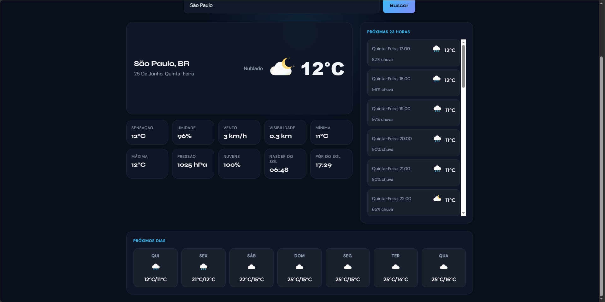
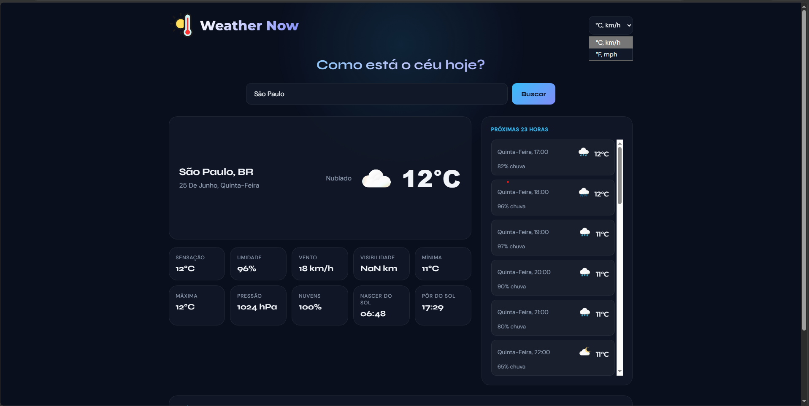

# Weather Now 🌤️

Aplicação web de previsão do tempo, construída com **HTML, CSS e JavaScript puro** (sem frameworks ou bibliotecas externas de UI). Permite buscar o clima atual de qualquer cidade do mundo, além da previsão horária e dos próximos 7 dias.


## 📸 Demonstração

  
 


## ✨ Funcionalidades

- 🔍 Busca de clima atual por nome de cidade
- 🌡️ Alternância entre unidades métricas (°C, km/h) e imperiais (°F, mph)
- 🕐 Previsão horária para as próximas 23 horas
- 📅 Previsão estendida para os próximos 7 dias
- 🌗 Ícones de clima dinâmicos, com variação entre dia e noite
- 📱 Layout responsivo (mobile e desktop)

## 🛠️ Tecnologias

- **HTML5** — estrutura semântica da página
- **CSS3** — estilização, grid/flexbox e responsividade
- **JavaScript (ES6+)** — lógica da aplicação, sem frameworks
- **[OpenWeatherMap API](https://openweathermap.org/api)** — dados do clima atual
- **[Open-Meteo API](https://open-meteo.com/)** — dados de previsão horária e semanal

## 📂 Estrutura do projeto

```
weather-app/
├── assets/
│   ├── preview1.png...  # imagens de previsão do site
│   ├── images/        # ícones de clima (sol, chuva, nublado, etc.)
│   └── logo/           # logo do projeto
├── weather-app.html     # estrutura da página
├── style.css            # estilos
├── script.js            # lógica da aplicação
├── config.example.js    # modelo de configuração (sem chave real)
├── LICENSE
└── README.md
```

## 🚀 Como executar localmente

### Pré-requisitos

- Um navegador atualizado (Chrome, Firefox, Edge, etc.)
- Uma chave de API gratuita da [OpenWeatherMap](https://openweathermap.org/api)

### Passo a passo

1. Clone o repositório
```bash
git clone https://github.com/seu-usuario/weather-app.git
```

2. Entre na pasta do projeto
```bash
cd weather-app
```

3. Crie seu arquivo de configuração local copiando o modelo:

```bash
cp config.example.js config.js
```

4. Abra o `config.js` e insira sua chave de API:

```js
const API_KEY = 'sua_chave_aqui';
```

5. Abra o arquivo `weather-app.html` no navegador (ou use a extensão **Live Server** no VS Code para recarregamento automático).


## 🔐 Sobre a chave de API

Este projeto não inclui nenhuma chave de API no repositório. Cada pessoa que for executar o projeto localmente deve gerar a própria chave gratuita em [openweathermap.org/api](https://openweathermap.org/api) e configurá-la no `config.js`, conforme as instruções acima.

## ⚠️ Limitações conhecidas

- Por ser um projeto 100% front-end, a chave de API fica visível nas requisições de rede do navegador quando a aplicação é publicada online. Em produção, o recomendado seria usar um backend/proxy para ocultar a chave por completo.
- O plano gratuito da OpenWeatherMap possui limite diário de chamadas.

## 📄 Licença

Este projeto está sob a licença MIT. Veja o arquivo [LICENSE](LICENSE) para mais detalhes.

## 👤 Autor

Feito por **[Felipe Souza]**.
📧 fesouza9contato@gmail.com · 🔗 [LinkedIn](#) · 🔗 [Portfólio](#)